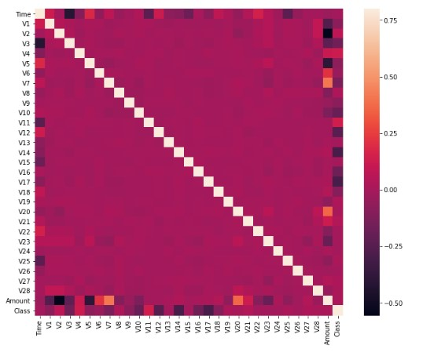

# Credit-card-fraud-detection

## Tools used 

numpy
pandas for importing dataset
matplotlib for data visualization 
seaborn for plotting heat map
sklearn for ml algorithm

## Visualising the data.

Dataset of around 28500 credit card transactions.
Seperated the dataset to x & y.
x contains around 30 parameters which are a result of PCA dimensionality reduction.
y represent the classes of each of the datapoints.
0 means normal transaction 1 means fraudulent.

## Analysing the dataset.
Plotting the correlation matrix to find if there are any relation between the parameters

Unsupervise learning 

## Algorithms used 

Isolation forest 
Local outlier factor algorithm

## Results 
Second algorithm worked better than the first.
Support vector machine wasn't used because it would take longer to train.
